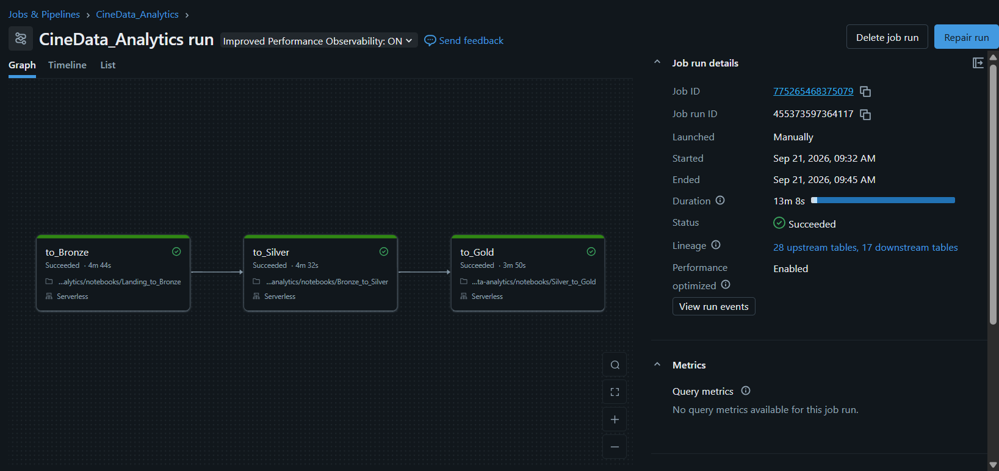
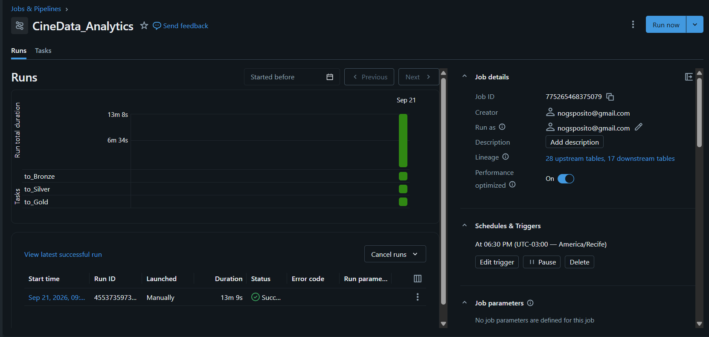

# CineData Analytics

Projeto desenvolvido para a atividade de Engenharia de Dados do RocketLab 2026.2, utilizando Databricks, PySpark, SQL e Delta Lake.

O pipeline organiza dados de filmes e cotações do dólar nas camadas Bronze, Silver e Gold, preparando tabelas para análise e documentos de contexto para um futuro assistente de IA.

## Etapas do projeto

| Notebook | Responsabilidade |
|---|---|
| [Landing_to_Bronze](Landing_to_Bronze.ipynb) | Ingestão dos cinco CSVs e da API de cotações do Banco Central, preservação das entradas e controle de cargas repetidas. |
| [Bronze_to_Silver](Bronze_to_Silver.ipynb) | Padronização, conversão de tipos, tratamento de inconsistências, deduplicação e cálculos financeiros. |
| [Silver_to_Gold](Silver_to_Gold.ipynb) | Construção das dimensões, tabelas de relacionamento, fato, contexto para IA e respostas às seis perguntas de negócio. |

Os notebooks apresentam os códigos, as verificações e os resultados observados durante o desenvolvimento.

## Como executar

1. Importe os três notebooks em um workspace Databricks com acesso ao Unity Catalog e execução de notebooks.
2. Disponibilize os cinco CSVs fornecidos na atividade no volume `/Volumes/workspace/landing/inputs`.
3. Garanta permissão para ler o volume, criar e gravar tabelas nos schemas `bronze`, `silver` e `gold`, além de acesso à API do Banco Central.
4. Execute os notebooks na ordem Bronze → Silver → Gold ou configure o Job usando [job.yaml](job.yaml) como referência, ajustando os caminhos dos notebooks ao seu workspace.
5. Execute apenas uma carga por vez e confira as validações antes de consumir os resultados.

### Parâmetros

| Notebook | Parâmetro | Formato e comportamento |
|---|---|---|
| Bronze | `data_inicio` e `data_fim` | `MM-DD-AAAA`. Quando ambos estão vazios, consulta os últimos sete dias corridos, incluindo o dia da execução. |
| Bronze | `id_lote` | Identificação da carga; quando vazio, utiliza a data da execução. |
| Silver | `data_referencia` | `AAAA-MM-DD`. Quando vazio, utiliza o dia da execução. |

Os arquivos CSV são entradas fornecidas pela atividade e devem ser disponibilizados separadamente.

## Orquestração

O Job `CineData_Analytics` executa as tarefas nesta sequência:

```text
to_Bronze → to_Silver → to_Gold
```

Cada etapa depende do sucesso da anterior. O agendamento foi configurado para 18h30 no fuso `America/Recife`.

### Execução concluída

A execução manual de 21/09/2026 terminou com sucesso nas três tarefas, com duração total de aproximadamente 13 minutos.



### Agendamento



## Reexecução e cuidados com os dados

A Bronze utiliza gravação em append com controle para evitar a repetição das mesmas cargas. As duplicidades existentes nos próprios CSVs são preservadas nessa camada. Alterações no conteúdo dos arquivos exigem revisão antes de uma nova ingestão.

A Silver e a Gold substituem suas tabelas durante o reprocessamento. As dimensões e os relacionamentos da Gold devem ser reconstruídos juntos, pois novos cadastros podem alterar as chaves geradas. Uma execução interrompida precisa ser concluída antes de consumir o conjunto atualizado.

## Limitações identificadas

- Permanecem 2.624 registros preservados somente nas tabelas auxiliares da Bronze, sem inclusão nas principais. Essa pendência limita a cobertura das camadas seguintes e o atendimento integral da ingestão.
- As regras de leitura e limpeza não garantem a correção de todos os valores deslocados ou nomes de entidades. Os casos observados estão documentados nos notebooks.
- As análises financeiras consideram os valores disponíveis, sem estimar informações ausentes. A conversão para reais utiliza a cotação de referência aplicada na Silver, não a cotação histórica de cada lançamento.
- A identificação de pessoas por nome e tipo de atuação pode agrupar homônimos.
- A entrega para IA consiste na tabela de documentos de contexto; não inclui implementação do assistente, embeddings ou banco vetorial.
